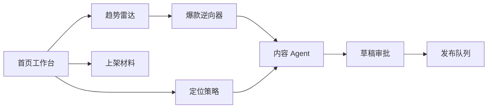
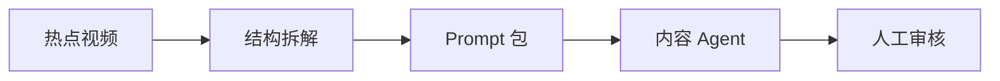
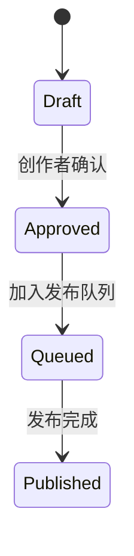

# CreatorOS 原型说明

## 信息架构



## 页面 1: 工作台

目标：让创作者一眼看到今天该做什么。

核心模块：

- 机会分：结合趋势热度、增速、账号定位匹配度。
- 近期爆款信号：展示可复制内容结构。
- 内容流水线：草稿、已确认、待发布、已发布。
- Agent 建议：下一步该更新定位、生成内容或安排发布。

## 页面 2: 趋势雷达

目标：服务短期起号，快速找到可复制的流量结构。

布局：

```text
+-------------------------------------------------------------+
| 平台筛选 | 内容形态筛选 | 赛道关键词                       |
+-------------------------------------------------------------+
| 热点卡片: 钩子 / 平台 / 增速 / 可复制度 / 适配建议          |
| 热点卡片: 钩子 / 平台 / 增速 / 可复制度 / 适配建议          |
| 热点卡片: 钩子 / 平台 / 增速 / 可复制度 / 适配建议          |
+-------------------------------------------------------------+
```

主要操作：

- 复制爆款：进入内容 Agent 并带入该热点。
- 逆向 Prompt：进入爆款逆向器并带入该热点。
- 监控赛道：加入长期监控列表。

## 页面 3: 爆款逆向器

目标：把热点视频拆成可复用的内容生产配方。

输入：

- 热点视频链接
- 平台
- 热点标题
- 赛道方向
- 目标账号
- 角色设定
- 字幕/口播稿/观察笔记

输出：

- 钩子类型
- 核心张力
- 情绪曲线
- 镜头语法
- 可复用结构
- 改写边界
- 角色 prompt、脚本 prompt、分镜 prompt、视频生成 prompt、封面 prompt

状态：



## 页面 4: 定位策略

目标：服务长期创作者，把“定位”转成可执行打法。

输入：

- 赛道
- 目标人群
- 创作者优势
- 账号阶段
- 商业目标
- 内容语气
- 平台

输出：

- 定位句
- 差异化护城河
- 内容支柱
- 30 天打法
- Agent 任务清单

## 页面 5: 内容 Agent

目标：把趋势和定位合成可发布内容。

输入：

- 选中的趋势信号
- 平台
- 内容形态
- 本次目标

输出：

- 标题/开头钩子
- 内容大纲
- 口播/正文
- 图文或视频分镜
- 标签
- CTA

状态流：



## 页面 6: 发布队列

目标：把已确认内容推进到分发状态。

MVP 展示：

- 内容标题
- 目标平台
- 发布时间
- 发布状态
- 模拟发布结果

真实版本扩展：

- 平台 OAuth 授权
- 内容审核
- 定时发布
- 失败重试
- 发布后数据回流

## 可点击原型

本项目的 `public/` 目录就是第一版可点击原型。启动 `server.js` 后访问 `http://localhost:5173` 即可体验。
